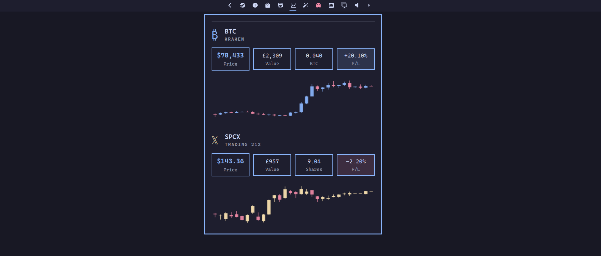

# Omarchy stocks plugin



Bar widget for Kraken BTC and Trading 212 SPCX positions: live price, P/L, and 30-day candlestick charts.  

Prices refresh every 5 minutes, including the figures on the bar. Click a market header to open TradingView (BTC) or Trading 212 (SPCX).

## Install

```bash
omarchy plugin add https://github.com/sebday/omarchy-stocks.git
omarchy plugin enable evo.stocks
```

## Requirements

- `curl`, `jq`, and `bash` on `PATH`
- Kraken API key with read access to balances and trades
- Trading 212 API key for the SPCX position

## Auth

Store credentials in `pass`:

```bash
pass insert omarchy/kraken/api-key
pass insert omarchy/kraken/api-secret
pass insert omarchy/trading212/api-key
pass insert omarchy/trading212/api-secret
```

## IPC

```bash
omarchy-shell evo.stocks toggle
omarchy-shell evo.stocks refresh
omarchy-shell shell toggle evo.stocks '{}'
```


## Removing

```bash
omarchy plugin remove evo.stocks
```

That deletes the plugin directory. It does not delete:

- `~/.cache/omarchy/bar/` and `~/.cache/omarchy/bar-history/`
- `pass` entries under `omarchy/kraken/` and `omarchy/trading212/`

Network: https://api.kraken.com, https://query1.finance.yahoo.com, https://live.trading212.com.
