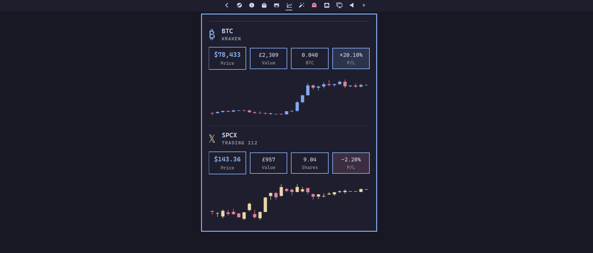

# Omarchy stocks plugin



Bar widget for Kraken BTC and Trading 212 SPCX. Each market is its own bar icon: live price, P/L, a 30-day candlestick chart, and three headlines at the bottom of the panel.

Prices refresh every 5 minutes, including the figure on the bar. Headlines refresh once a day. Click a market header to open TradingView (BTC) or Trading 212 (SPCX).

## Two icons

Place one layout entry per market in `~/.config/omarchy/shell.json`:

```json
{ "id": "evo.stocks", "market": "btc" },
{ "id": "evo.stocks", "market": "spcx" }
```

## Headlines

`bin/market-news` asks the Omarchy default agent for three headlines and caches them for 24 hours. `omarchy agent` opens a terminal, so the script runs that same agent headless (`cursor-agent --print --mode ask`). It does not pass `--model`. Cursor then uses the model selected in `~/.cursor/cli-config.json`. An untouched CLI config selects Auto, model id `default`.

## Install

```bash
omarchy plugin add https://github.com/sebday/omarchy-stocks.git
omarchy plugin enable evo.stocks
```

## Requirements

- `curl`, `jq`, and `bash` on `PATH`
- Kraken API key with read access to balances and trades
- Trading 212 API key for the SPCX position

## Auth

Store credentials in `pass`:

```bash
pass insert omarchy/kraken/api-key
pass insert omarchy/kraken/api-secret
pass insert omarchy/trading212/api-key
pass insert omarchy/trading212/api-secret
```

## IPC

```bash
omarchy-shell evo.stocks.btc toggle
omarchy-shell evo.stocks.spcx toggle
omarchy-shell evo.stocks.btc refresh
omarchy-shell evo.stocks.spcx refresh
```


## Removing

```bash
omarchy plugin remove evo.stocks
```

That deletes the plugin directory. It does not delete:

- `~/.cache/omarchy/bar/` and `~/.cache/omarchy/bar-history/`
- `pass` entries under `omarchy/kraken/` and `omarchy/trading212/`

Network: https://api.kraken.com, https://query1.finance.yahoo.com, https://live.trading212.com, and the default agent's API for the daily headlines.
